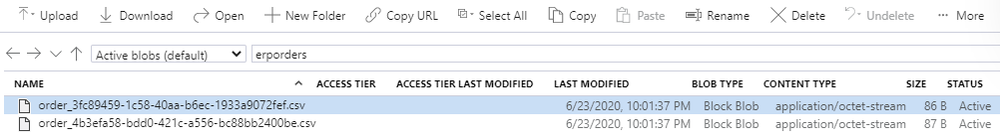

This repo contains the technical instructions to complete an end-to-end scenario for running Logic Apps within the Dapr runtime.  More information can be found on this blog.

## Setup your environment

* Install the [REST Client extension](https://marketplace.visualstudio.com/items?itemName=humao.rest-client) for Visual Studio Code

* Install the [Azure CLI](https://docs.microsoft.com/en-us/cli/azure/install-azure-cli?view=azure-cli-latest)

* Install the [Dapr CLI](https://github.com/dapr/cli#getting-started)

* Install the latest Dapr runtime to get started.

```
dapr init --kubernetes
```

* Clone this repo

```
git clone https://github.com/your-azure-coach/dapr-logic-apps.git
```

## Create Azure resources

* Log into Azure CLI and follow the instructions

```
az login
```

* Create an Azure resource group

```
az group create --name dapr-logic-apps --location westeurope
```

* Choose a unique Azure storage account name

```
set STORAGE_ACCOUNT_NAME=<YOUR_UNIQUE_STORAGE_ACCOUNT_NAME>
```

* Create an Azure storage account.  This will be used for persisting the Logic Apps internal state and also as a state store and output binding.

```
az storage account create --name %STORAGE_ACCOUNT_NAME% --resource-group dapr-logic-apps
```

* List the storage account keys

```
az storage account keys list --account-name %STORAGE_ACCOUNT_NAME%
```

* Set storage account key variable (retrieve the key from the previous command result)

```
set STORAGE_ACCOUNT_KEY=<YOUR_STORAGE_ACCOUNT_KEY>
```

## Configure Dapr workflows on your Kubernetes cluster

* Create a secret for the Azure storage account credentails

```
kubectl create secret generic dapr-workflows --from-literal=accountName=%STORAGE_ACCOUNT_NAME% --from-literal=accountKey=%STORAGE_ACCOUNT_KEY%
```

* Create a Kubernetes Config Map to store the Logic Apps workflow definition

```
kubectl create configmap workflow-order-import-config --from-file ./workflows/order-import.json
```

* Create a Dapr State Store that points to Azure Table Storage

```
kubectl apply -f components/state-store-customers.yaml
```

* Create a Dapr Output Binding that points to Azure Blob Storage

```
kubectl apply -f components/output-binding-erp-orders.yaml
```

* Create Kubernetes deployment from the Dapr worflow image that is configured with the Logic Apps definition

```
kubectl apply -f deploy/workflow-order-import-app.yaml
```

* Wait until the deployment finished successfully

```
kubectl get deployment workflow-order-import-app
```

* Setup port forwarding, so we can easily test

```
kubectl port-forward deploy/workflow-order-import-app 3500:3500
```

## Test the Dapr workflows

* Open the `requests/prerequisites.http` file in Visual Studio Code and execute the required commands with the REST Client extension.  This populates and validates the customer state store.

* Open the `requests/tests.http` file in Visual Studio Code and execute the POST command that invokes the Logic App workflow

* As a result, you should see two CSV orders appearing in the `erp-orders` Blob Storage container.



## Clean-up resources

* Delete Kubernetes deployment

```
kubectl delete deployment workflow-order-import-app
```

* Delete the `erp-orders` output binding to Azure Blob Storage

```
kubectl delete component erp-orders
```

* Delete the `customer-store` state store on Azure Table Storage

```
kubectl delete component customer-store
```

* Delete the config map that holds the Logic Apps definition

```
kubectl delete configmap workflow-order-import-config
```

* Delete Kubernetes secrets

```
kubectl delete secret dapr-workflows
```

* Delete all Azure resources

```
az group delete --name dapr-logic-apps --yes
```